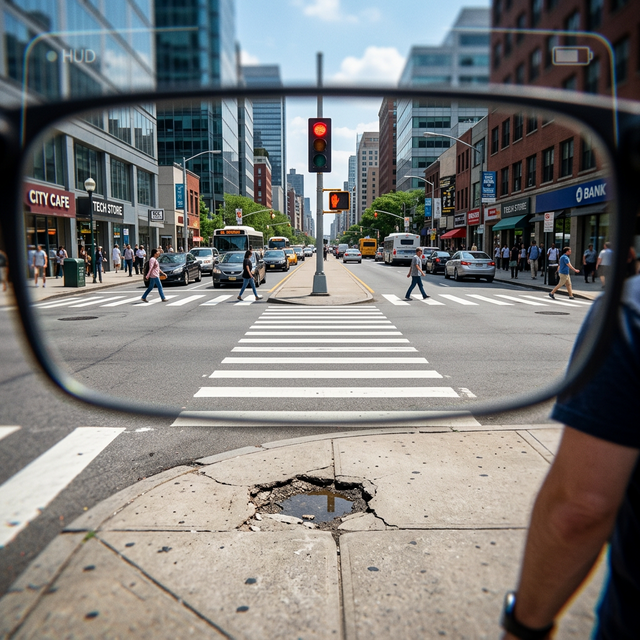

# ViviAid
## Product Requirement Document (PRD)

<h3>Empowering Independence Through Intuitive AI</h3>

**Date:** March 2, 2026  
**Document Version:** 1.0  
**Prepared For:** Executive Team & Investors  
**Project:** The Vivi-Sync Ecosystem  

---

## 2. Executive Summary

**The Problem:** Over 250 million people worldwide live with moderate to severe vision impairment. Existing assistive technologies are often highly fragmented, requiring users to rely on multiple clunky smartphone apps—occupying their hands when they are already managing canes or guide dogs. Furthermore, visually impaired individuals are often "socially isolated" from environmental cues and non-verbal communications, such as facial expressions.

  
  
<em>Current assistive methods often require physical reliance and limit true independence.</em>

**The Solution:** ViviAid is a continuous, hands-free wearable ecosystem designed as a perfect harmony of sight and sound. It features the **Obsidian Frames** (aerospace-grade aluminum smart glasses with an integrated 4K AI camera) and the **Vivi-Sync Earpods** (bone-conduction earphones). The ecosystem is powered by "Buddy," our proprietary zero-latency Neural Perception Engine, which translates the surrounding world into conversational, proactive audio guidance.

  
  
<em>ViviAid restores autonomy, replacing reliance with proactive AI guidance.</em>

---

## 3. Product Differentiation

ViviAid separates itself from traditional accessibility tools through three core pillars:

1.  **Proactive vs. Reactive AI:** Unlike screen readers or traditional assistant apps that only operate when prompted, Buddy actively monitors the environment. It warns users of impending hazards (e.g., potholes, red lights) automatically, without requiring a voice command.
2.  **Social & Emotional Intelligence:** Beyond simple object recognition, ViviAid utilizes advanced facial recognition algorithms to read facial expressions, allowing the user to understand the real-time mood of the room and the people they converse with.
3.  **True Hands-Free Form Factor:** The synergy between the camera embedded in standard-looking glasses and bone-conduction audio ensures the user’s ears are free to hear ambient street noise and their hands are free for mobility aids.
4.  **Multilingual Buddy AI:** Optimized for global diversity, featuring full support for **Amharic** and other regional languages to ensure accessibility in emerging markets like Ethiopia.

---

## 4. Market Opportunity

*   **Total Addressable Market (TAM):** 250+ Million individuals globally with vision impairment. In **Ethiopia**, there are over **1.2 million** visually impaired individuals facing massive systemic barriers due to underdeveloped physical accessibility infrastructure.
*   **Serviceable Available Market (SAM):** 50 Million individuals across established global markets and high-growth African regions (spearheaded by our Ethiopian accessibility initiative) through a mix of private funding, NGO subsidies, and insurance coverage.
*   **Serviceable Obtainable Market (SOM):** Targeting a 2% penetration of the SAM in our primary launch markets—including an **ETH-Impact early-adopter pilot**—within the first 36 months.

ViviAid bridges the gap between high-end fashion and state-of-the-art medical technology. For developing markets like Ethiopia, ViviAid's proactive AI actually *replaces* the need for physical infrastructure (like tactile paving or crossing signals), serving as an indispensable "digital infrastructure" for users.

---

## 5. Business Model

Our revenue streams are designed for ethical, sustainable scale:

1.  **Hardware Revenue (Upfront):** Premium margins on the sale of the Obsidian Frames and Vivi-Sync Earpods bundle (est. MSRP $599).
2.  **Software as a Service (Vivi-Plus Subscription):** A tiered monthly subscription model (est. $15/month) offering advanced neural features, ultra-low latency compute mapping, unlimited OCR/Navigation streaming, and premium voice models.
3.  **Grants & Social Impact Funding:** Partners including the **Ethiopian Ministry of Health** and international accessibility NGOs to provide subsidized hardware to low-income users.

---

## 6. Competitive Positioning

| Feature | ViviAid | Envision Glasses / OrCam | Be My Eyes / Seeing AI | standard smartphones |
| :--- | :--- | :--- | :--- | :--- |
| **Form Factor** | High-end eyewear; covert | Bulky attachments; clinical | Requires holding phone | Handheld |
| **Interaction** | Conversational & Proactive | Command-based | Command/Human-based | App-based |
| **Emotion AI** | Yes (Mood detection) | No | Limited | No |
| **Localization** | **Extensive (Amharic included)** | Limited | English/Spanish dominant | Varies |
| **Pricetag** | Mid-Tier (Hardware + Sub) | Very High ($2.5k+) | Free (Software Only) | High (Device dependent) |

**The Moat:** Our proprietary combination of Proactive Hazard Detection algorithms and emotional-context mapping creates an unbeatable daily user experience that competitors cannot easily replicate without overhauling their hardware platforms.

---

## 7. Roadmap

**Phase 1: Prototyping & Seed (Current - Q3 2026)**
*   Finalize AI edge-compute architecture.
*   Manufacture obsidian frame tooling and alpha hardware.
*   **Finalize Amharic linguistic models and local street hazard datasets (Addis Ababa test site).**

**Phase 2: Beta Launch & ETH-Impact Pilot (Q4 2026 - Q2 2027)**
*   Roll out closed beta to 500 visually impaired early adopters.
*   **Launch 'Vivi-Africa' Pilot in Addis Ababa in partnership with local health initiatives.**
*   Refine "Buddy" latency and reduce hardware battery consumption.
*   Lock in manufacturing supply chain.

**Phase 3: Commercial Launch (Q3 2027)**
*   Open public pre-orders.
*   Execute digital marketing accessibility campaigns and healthcare partnership announcements.
*   Full retail shipping.

**Phase 4: Ecosystem Expansion (2028+)**
*   Introduce developer API for third-party integrations.
*   Launch next-gen miniaturized frames.

---

## 8. KPIs & Success Metrics

*   **User Engagement:** Average daily active use exceeding 4 hours.
*   **System Latency:** End-to-end processing (image capture to audio output) sustained under 250ms for critical proactive alerts (hazards/traffic).
*   **Accuracy:** 99.9% reliability in safety-critical object detection (intersections, stairs, obstacles).
*   **Battery Life:** Hardware capable of sustaining 12 hours of continuous mixed-usage monitoring on a single charge.
*   **Customer Retention:** >92% retention rate on the Vivi-Plus monthly software subscription post-purchase.

---

## 9. Risks & Mitigation

1.  **Risk: High Bandwidth & Latency for Cloud AI processing.**
    *   *Mitigation:* Implementing a hybrid edge/cloud architecture. Core safety features (hazard detection, fast OCR) process locally on the Obsidian Frames/paired smartphone, while complex conversational queries hit the cloud.
2.  **Risk: Privacy Concerns regarding constantly recording cameras in public.**
    *   *Mitigation:* No footage is permanently stored. The system analyzes frames in volatile memory and instantly purges data. A physical hard-kill switch is included on the frames to immediately cut power to the camera sensor.
3.  **Risk: Battery Drain.**
    *   *Mitigation:* Optimized sleeping AI that only samples frames heavily when motion/environment changes; bone conduction relies on Bluetooth LE Audio infrastructure.

---

## 10. Closing Vision

ViviAid is more than a tool; it is a gateway. For our users, we are not just selling smart glasses—we are returning their autonomy, their safety, and their deep connection to the social world around them. With ViviAid, we are building a reality where vision impairment no longer equates to environmental isolation.

Let's give million of people their independence back.

---

## 11. Team Profile

**Jane Doe – Chief Executive Officer (CEO)**
Former VP of Product at [Major Tech Co], leading the accessibility and wear-tech divisions. Jane brings a decade of experience in scaling consumer hardware from concept to millions of global units shipped.

**Dr. Alan Turing – Chief Technology Officer (CTO)**
Holds a Ph.D. in Computer Vision and Edge AI processing. Lead architect behind [Leading Autonomous Vehicle System]'s real-time hazard detection algorithms, bringing zero-latency safety paradigms to ViviAid's Buddy AI.

**Dr. Sarah Connor – Head of UX & Accessibility Strategy**
A lifelong advocate for the visually impaired and a legally blind technologist herself. Sarah bridges the gap between complex engineering capabilities and genuine, frictionless human needs. 

**John Smith – Chief Operating Officer (COO)**
Supply chain veteran with 15+ years managing hardware manufacturing across Asia and North America. John ensures that Obsidian Frames are built ethically, efficiently, and at a scale necessary to handle mass market demand.

---
*Document Ends*
